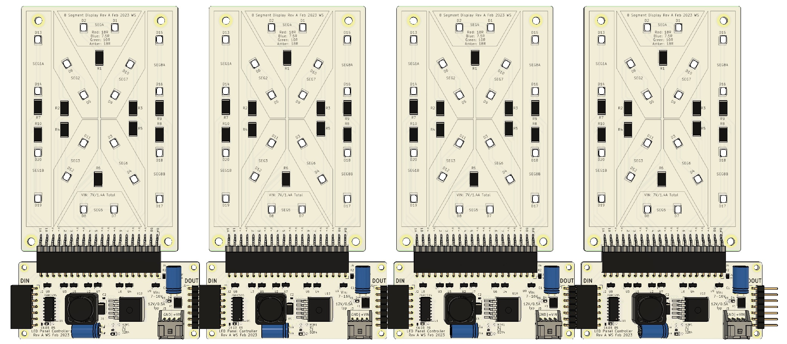

# 8 Segment Numeric DIsplay

A 10W/digit numeric display to show numbers in any room.

The display is a 65mm x 102mm single layer aluminum PCB. It has a 1x20 SMT male header in order to connect a driver board. The display requires active cooling for duty cycles above 50%. 

The driver is a 75mm x 32mm double layer FR4 PCB. It relies on a 74HC595 shift register to drive a chain of displays using a single data stream. The driving microcontroller can send 3.3V or 5V logic. The logic level is set by the reference voltage on the input. The driver has an onboard buck converter to create the drive voltage of the display. The board can receive 7-16VDC (Peak current draw is 10W/Vin). 
 
**Driving Logic**

- Pull nCLR high in order to prevent an accidential clear
- Use SRCLK and SER to send a data packet to the first number's data packet on the right (with LSB first)
- Repeat sending data until all numbers are sent.
- Pulse RCLK to push shifted bits into the outputs
- Use PWM on nOE to adjust the display brightness. Note: The brightness will lower with higher duty cycles.

|Number to display| Data packet|
|--|--|
|0|0b10111011|
|1|0b00000011|
|2|0b00111010|
|3|0b00011110|
|4|0b01000110|
|5|0b01011100|
|6|0b00101110|
|7|0b00110010|
|8|0b01111110|
|9|0b01110010|
